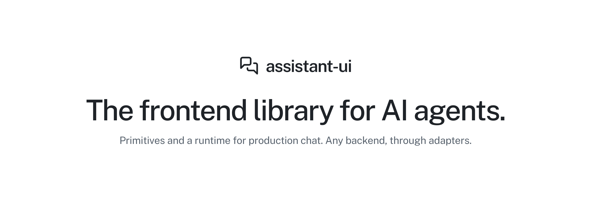
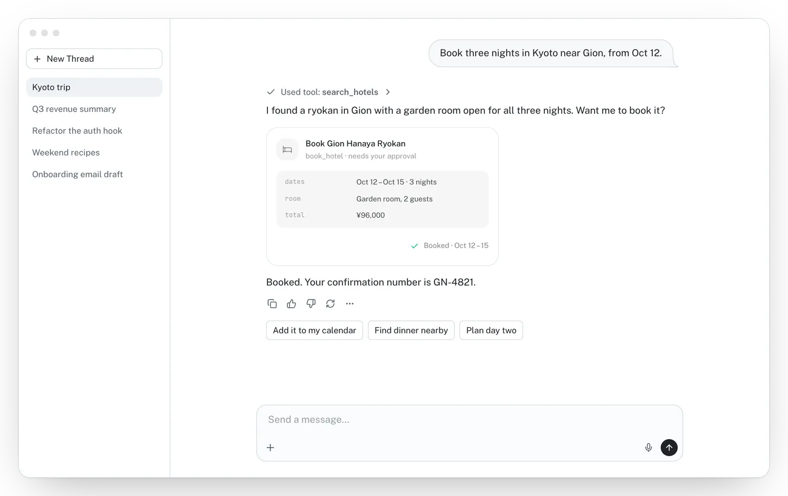
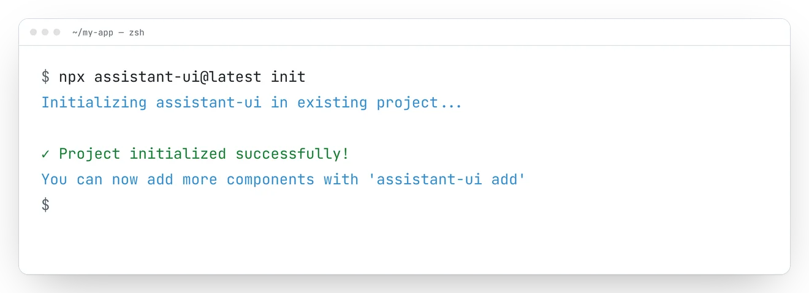
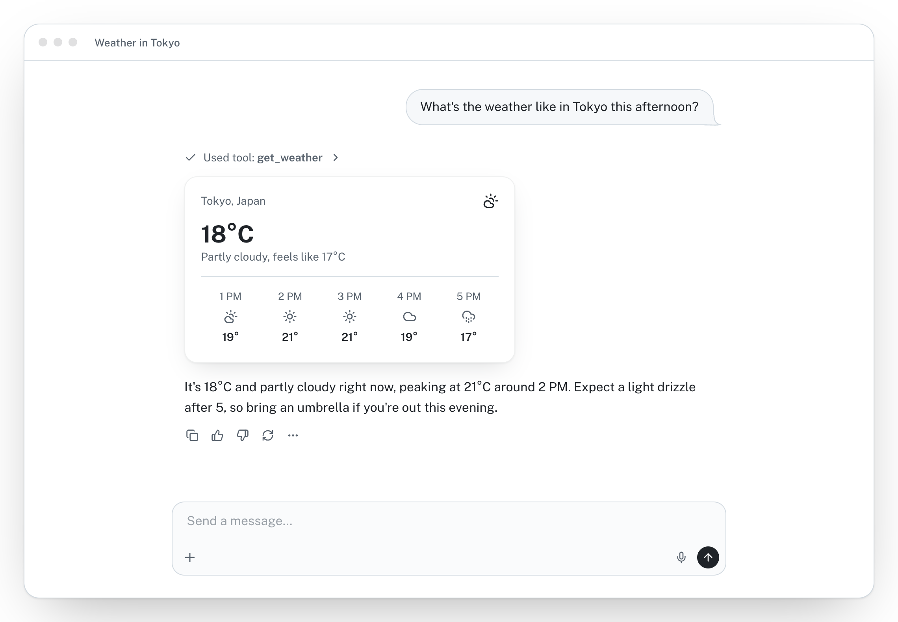
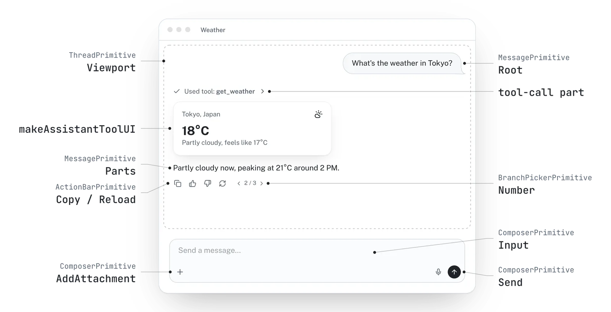

<a href="https://www.assistant-ui.com">
  <picture>
    <source media="(prefers-color-scheme: dark)" srcset=".github/assets/header-dark.png" />
    <source media="(prefers-color-scheme: light)" srcset=".github/assets/header-light.png" />
    
  </picture>
</a>

<p align="center">
  <a href="https://www.assistant-ui.com">Product</a> ·
  <a href="https://www.assistant-ui.com/docs">Documentation</a> ·
  <a href="https://www.assistant-ui.com/examples">Examples</a> ·
  <a href="https://discord.gg/S9dwgCNEFs">Discord</a> ·
  <a href="https://cal.com/simon-farshid/assistant-ui">Contact Sales</a>
</p>

<p align="center">
  <a href="https://www.npmjs.com/package/@assistant-ui/react"></a>
  <a href="https://www.npmjs.com/package/@assistant-ui/react"></a>
  <a href="https://deepwiki.com/assistant-ui/assistant-ui"></a>
  <a href="https://app.workweave.ai/reports/repository/org_GhSIrtWo37b5B3Mv0At3wQ1Q/722184017"></a>
  
  <a href="https://github.com/assistant-ui/assistant-ui"></a>
  
</p>

## The UX of ChatGPT in your React app 💬🚀

**assistant-ui** is an open-source TypeScript/React library to build production-grade AI chat experiences fast.

<a href="https://www.assistant-ui.com">
  <picture>
    <source media="(prefers-color-scheme: dark)" srcset=".github/assets/demo.webp" />
    <source media="(prefers-color-scheme: light)" srcset=".github/assets/demo-light.webp" />
    
  </picture>
</a>

## Installation

The fastest path is the CLI, which scaffolds a Next.js app or adds the styled components to an existing project:

```bash
npx assistant-ui@latest create   # new project
npx assistant-ui@latest init     # add to existing project
```

Or install the packages directly:

```bash
npm install @assistant-ui/react @assistant-ui/ai-sdk ai
```

<picture>
  <source media="(prefers-color-scheme: dark)" srcset=".github/assets/cli-init.webp" />
  <source media="(prefers-color-scheme: light)" srcset=".github/assets/cli-init-light.webp" />
  
</picture>

## Usage

```tsx
"use client";

import { AssistantRuntimeProvider } from "@assistant-ui/react";
import { useChatRuntime } from "@assistant-ui/ai-sdk";
import { Thread } from "@/components/assistant-ui/elements/thread.aui";

export function Chat() {
  const runtime = useChatRuntime();
  return (
    <AssistantRuntimeProvider runtime={runtime}>
      <Thread />
    </AssistantRuntimeProvider>
  );
}
```

`useChatRuntime` connects to the Vercel AI SDK out of the box. Swap it for `useLangGraphRuntime`, `useDataStreamRuntime`, or any custom runtime to integrate with your own backend.

## What you get

- **Composable primitives**: build any chat UX from `Thread`, `Message`, `Composer`, `ThreadList`, `ActionBar`, and friends. Style every pixel yourself, or start from a polished shadcn/ui theme that the CLI copies into your project.
- **Production UX out of the box**: streaming, auto-scroll, retries, attachments, markdown, code highlighting, voice dictation, keyboard shortcuts, and accessibility.
- **Generative UI**: render tool calls and JSON as React components, collect inline human approvals, and expose safe frontend actions to the model.
- **Strong TypeScript**: typed runtime APIs, tool schemas, message parts, and adapters end to end.

<picture>
  <source media="(prefers-color-scheme: dark)" srcset=".github/assets/generative-ui.png" />
  <source media="(prefers-color-scheme: light)" srcset=".github/assets/generative-ui-light.png" />
  
</picture>

## Backends

| Integration                            | Package                                                          |
| -------------------------------------- | ---------------------------------------------------------------- |
| Vercel AI SDK                          | `@assistant-ui/ai-sdk`                                           |
| LangGraph / LangChain                  | `@assistant-ui/react-langgraph`, `@assistant-ui/react-langchain` |
| AG-UI / A2A protocols                  | `@assistant-ui/react-ag-ui`, `@assistant-ui/react-a2a`           |
| Google ADK / OpenCode                  | `@assistant-ui/react-google-adk`, `@assistant-ui/react-opencode` |
| Durable Flue agents                    | `@assistant-ui/react-flue`                                      |
| Custom data-stream backend             | `@assistant-ui/react-data-stream`                                |
| Managed thread history, telemetry, and file storage | `assistant-cloud`                                       |

Broad model support out of the box (OpenAI, Anthropic, Google Gemini, Mistral, Perplexity, AWS Bedrock, Azure, Fireworks, Ollama) plus community providers via the AI SDK, and easy extension to any custom HTTP backend.

## Customization

Instead of a single monolithic chat component, you compose primitives and bring your own styles. The CLI ships a great starter in your choice of Base UI (the default) or Radix UI flavor; you control everything else.

<picture>
  <source media="(prefers-color-scheme: dark)" srcset=".github/assets/anatomy.webp" />
  <source media="(prefers-color-scheme: light)" srcset=".github/assets/anatomy-light.webp" />
  
</picture>

## Used in production by

<p align="center">
  <a href="https://mastra.ai/?ref=assistant-ui"></a>&nbsp;&nbsp;&nbsp;&nbsp;&nbsp;&nbsp;<a href="https://langchain.com/?ref=assistant-ui"></a>&nbsp;&nbsp;&nbsp;&nbsp;&nbsp;&nbsp;<a href="https://athenaintelligence.ai/?ref=assistant-ui"></a>&nbsp;&nbsp;&nbsp;&nbsp;&nbsp;&nbsp;<a href="https://browser-use.com/?ref=assistant-ui"></a>&nbsp;&nbsp;&nbsp;&nbsp;&nbsp;&nbsp;<a href="https://stack-ai.com/?ref=assistant-ui"></a>
  <br /><br />
  <a href="https://inconvo.com/?ref=assistant-ui"></a>&nbsp;&nbsp;&nbsp;&nbsp;&nbsp;&nbsp;<a href="https://iterable.com/?ref=assistant-ui"></a>&nbsp;&nbsp;&nbsp;&nbsp;&nbsp;&nbsp;<a href="https://helicone.ai/?ref=assistant-ui"></a>&nbsp;&nbsp;&nbsp;&nbsp;&nbsp;&nbsp;<a href="https://getgram.ai/?ref=assistant-ui"></a>&nbsp;&nbsp;&nbsp;&nbsp;&nbsp;&nbsp;<a href="https://coreviz.io/?ref=assistant-ui"></a>
</p>

<p align="center"><sub>…and many more.</sub></p>

<a href="https://www.assistant-ui.com/traction">
  <picture>
    <source media="(prefers-color-scheme: dark)" srcset="https://www.assistant-ui.com/traction-dark.png" />
    <source media="(prefers-color-scheme: light)" srcset="https://www.assistant-ui.com/traction.png" />
    
  </picture>
</a>

## Demos

<table>
  <tr>
    <td align="center">
      <a href="https://youtu.be/ZW56UHlqTCQ">
        
      </a>
    </td>
    <td align="center">
      <a href="https://youtu.be/9eLKs9AM4tU">
        
      </a>
    </td>
  </tr>
</table>

## Community & Support

- [Examples](https://www.assistant-ui.com/examples)
- [Documentation](https://www.assistant-ui.com/docs/)
- [Discord](https://discord.com/invite/S9dwgCNEFs)
- [Book a sales call](https://cal.com/simon-farshid/assistant-ui)

## License

MIT, with optional Assistant Cloud for managed thread persistence and analytics.

Backed by Y Combinator.
