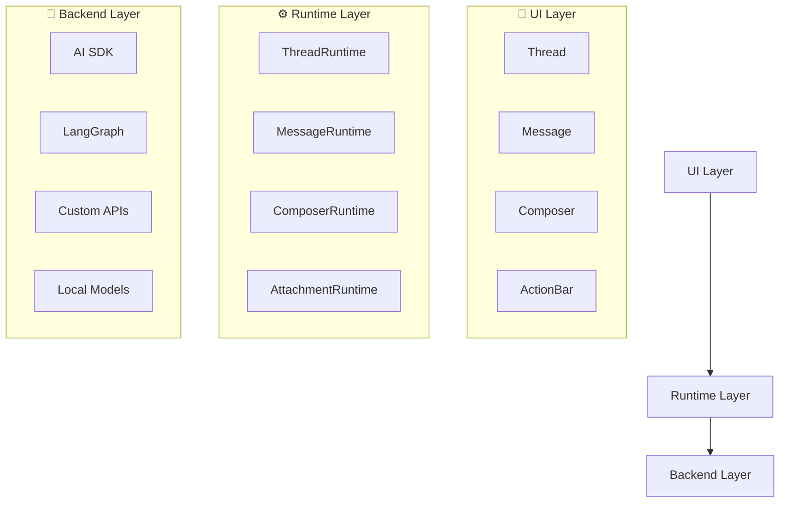
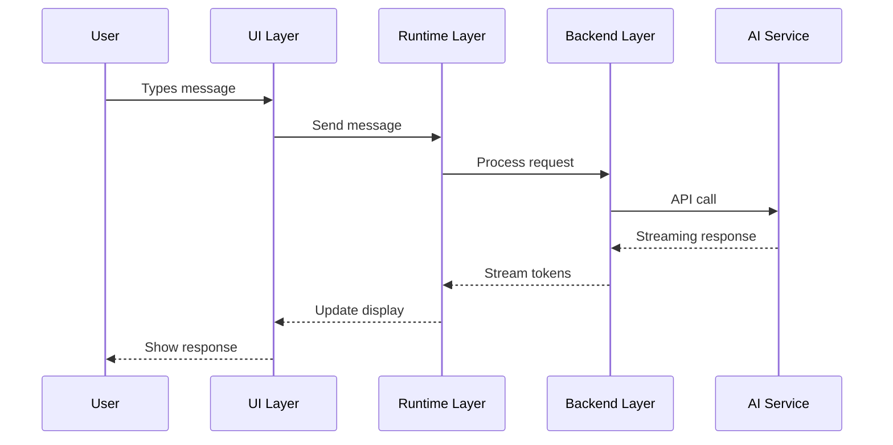

# Architecture Overview

Assistant UI uses a layered architecture that separates concerns and provides maximum flexibility. Understanding this architecture is key to building sophisticated AI chat interfaces.

## The Three Layers



### 1. UI Layer - What Users See

The UI layer contains all the visual components:

- **Thread**: The main chat interface
- **Message**: Individual message bubbles
- **Composer**: The input area for typing messages
- **ActionBar**: Actions like copy, edit, regenerate

These components are **headless by default** - you can use the built-in styling or create your own.

### 2. Runtime Layer - State Management

The runtime layer manages all the state and logic:

- **ThreadRuntime**: Manages conversation state, message history
- **MessageRuntime**: Handles individual message operations
- **ComposerRuntime**: Controls message composition and sending
- **AttachmentRuntime**: Manages file uploads and processing

This layer is **backend-agnostic** - it works with any AI service.

### 3. Backend Layer - AI Integration

The backend layer connects to AI services:

- **AI SDK**: Vercel's AI SDK for OpenAI, Anthropic, etc.
- **LangGraph**: LangChain's graph-based workflows
- **Custom APIs**: Your own backend services
- **Local Models**: Run models locally with Ollama, etc.

## Data Flow

Here's how data flows through the system:



## Key Design Principles

### 1. Composition Over Configuration

Instead of monolithic components with many props, Assistant UI uses small, composable primitives:

```tsx
// Good: Composable
<Thread>
  <Thread.Messages>
    <Message>
      <Message.Content />
      <Message.Actions>
        <ActionBar.Copy />
        <ActionBar.Reload />
      </Message.Actions>
    </Message>
  </Thread.Messages>
  <Composer>
    <Composer.Input />
    <Composer.Send />
  </Composer>
</Thread>

// Avoid: Monolithic
<Chat 
  showCopy={true}
  showReload={true}
  inputPlaceholder="Type..."
  // 20+ more props...
/>
```

### 2. Headless by Default

UI components are unstyled by default, giving you complete design control:

```tsx
// Use built-in styling
import { Thread } from "@assistant-ui/react";

// Or build your own
import { ThreadPrimitive } from "@assistant-ui/react";

function CustomThread() {
  return (
    <ThreadPrimitive.Root className="my-custom-thread">
      {/* Your custom implementation */}
    </ThreadPrimitive.Root>
  );
}
```

### 3. Type Safety

Everything is fully typed with TypeScript:

```tsx
import type { MessageRuntime, ToolCallContentPart } from "@assistant-ui/react";

// Full IntelliSense and type checking
function CustomMessage({ message }: { message: MessageRuntime }) {
  if (message.content.type === "tool-call") {
    // TypeScript knows this is a ToolCallContentPart
    const toolCall = message.content;
  }
}
```

## Benefits of This Architecture

1. **Flexibility**: Use any UI framework, styling approach, or backend
2. **Maintainability**: Clear separation of concerns
3. **Testability**: Each layer can be tested independently
4. **Performance**: Efficient state management and rendering
5. **Developer Experience**: Full TypeScript support and great tooling

## Next Steps

Now that you understand the architecture, let's dive into the component fundamentals and start building real features.

Continue to [Component Fundamentals →](./04-component-fundamentals)