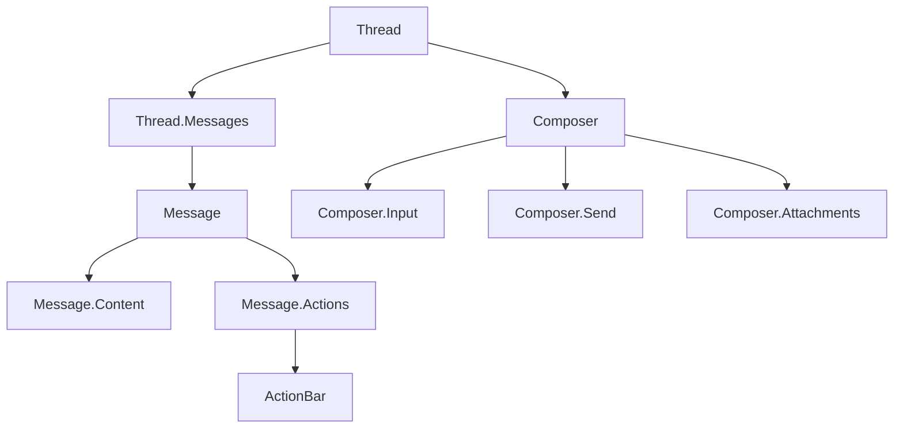

# Component Fundamentals

Assistant UI provides a rich set of components that work together to create sophisticated chat interfaces. Let's explore the core components and how to compose them effectively.

## Core Components Overview



## Thread Component

The `Thread` component is the main container for your chat interface:

```tsx
import { Thread } from "@assistant-ui/react";

function BasicChat() {
  return (
    <div className="h-screen max-w-2xl mx-auto p-4">
      <Thread />
    </div>
  );
}
```

### Custom Thread Layout

Build a custom layout using Thread primitives:

```tsx
import { ThreadPrimitive } from "@assistant-ui/react";

function CustomThread() {
  return (
    <ThreadPrimitive.Root className="flex flex-col h-screen">
      {/* Header */}
      <header className="border-b p-4">
        <h1>AI Assistant</h1>
      </header>
      
      {/* Messages */}
      <ThreadPrimitive.Messages className="flex-1 overflow-y-auto p-4">
        <CustomMessage />
      </ThreadPrimitive.Messages>
      
      {/* Composer */}
      <div className="border-t p-4">
        <CustomComposer />
      </div>
    </ThreadPrimitive.Root>
  );
}
```

## Message Component

Messages display individual chat messages with rich content support:

```tsx
import { MessagePrimitive } from "@assistant-ui/react";

function CustomMessage() {
  return (
    <MessagePrimitive.Root className="flex gap-3 mb-4">
      {/* Avatar */}
      <MessagePrimitive.If by="user">
        <div className="w-8 h-8 bg-blue-500 rounded-full" />
      </MessagePrimitive.If>
      <MessagePrimitive.If by="assistant">
        <div className="w-8 h-8 bg-gray-500 rounded-full" />
      </MessagePrimitive.If>
      
      {/* Content */}
      <div className="flex-1">
        <MessagePrimitive.Content />
        
        {/* Actions */}
        <MessagePrimitive.Actions>
          <CustomActionBar />
        </MessagePrimitive.Actions>
      </div>
    </MessagePrimitive.Root>
  );
}
```

### Message Content Types

Messages can contain different types of content:

```tsx
import { MessagePrimitive, ContentPartPrimitive } from "@assistant-ui/react";

function MessageContent() {
  return (
    <MessagePrimitive.Content>
      {/* Text content */}
      <ContentPartPrimitive.Text />
      
      {/* Image content */}
      <ContentPartPrimitive.Image />
      
      {/* Tool call results */}
      <ContentPartPrimitive.Tools />
    </MessagePrimitive.Content>
  );
}
```

## Composer Component

The Composer handles message input and sending:

```tsx
import { ComposerPrimitive } from "@assistant-ui/react";

function CustomComposer() {
  return (
    <ComposerPrimitive.Root className="flex items-end gap-2">
      {/* Attachments */}
      <ComposerPrimitive.Attachments>
        <CustomAttachmentUI />
      </ComposerPrimitive.Attachments>
      
      {/* Input */}
      <ComposerPrimitive.Input 
        className="flex-1 p-3 border rounded-lg resize-none"
        placeholder="Type your message..."
      />
      
      {/* Send button */}
      <ComposerPrimitive.Send className="p-3 bg-blue-500 text-white rounded-lg">
        Send
      </ComposerPrimitive.Send>
    </ComposerPrimitive.Root>
  );
}
```

## ActionBar Component

ActionBars provide contextual actions for messages:

```tsx
import { ActionBarPrimitive } from "@assistant-ui/react";

function CustomActionBar() {
  return (
    <ActionBarPrimitive.Root className="flex gap-1 mt-2">
      <ActionBarPrimitive.Copy className="p-1 hover:bg-gray-100 rounded">
        📋
      </ActionBarPrimitive.Copy>
      
      <ActionBarPrimitive.Reload className="p-1 hover:bg-gray-100 rounded">
        🔄
      </ActionBarPrimitive.Reload>
      
      <ActionBarPrimitive.Edit className="p-1 hover:bg-gray-100 rounded">
        ✏️
      </ActionBarPrimitive.Edit>
    </ActionBarPrimitive.Root>
  );
}
```

## Conditional Rendering

Use conditional components to show different UI based on state:

```tsx
import { MessagePrimitive, ThreadPrimitive } from "@assistant-ui/react";

function ConditionalUI() {
  return (
    <div>
      {/* Show only for user messages */}
      <MessagePrimitive.If by="user">
        <div className="text-right">
          <MessagePrimitive.Content />
        </div>
      </MessagePrimitive.If>
      
      {/* Show only for assistant messages */}
      <MessagePrimitive.If by="assistant">
        <div className="text-left">
          <MessagePrimitive.Content />
        </div>
      </MessagePrimitive.If>
      
      {/* Show when thread is running */}
      <ThreadPrimitive.If running>
        <div>AI is thinking...</div>
      </ThreadPrimitive.If>
      
      {/* Show when thread is empty */}
      <ThreadPrimitive.If empty>
        <div>Start a conversation!</div>
      </ThreadPrimitive.If>
    </div>
  );
}
```

## Styling Approaches

### 1. Styled Components

```tsx
import styled from "styled-components";
import { ThreadPrimitive } from "@assistant-ui/react";

const StyledThread = styled(ThreadPrimitive.Root)`
  display: flex;
  flex-direction: column;
  height: 100vh;
  background: white;
`;

const StyledMessage = styled(MessagePrimitive.Root)`
  display: flex;
  gap: 12px;
  margin-bottom: 16px;
  
  &[data-by="user"] {
    flex-direction: row-reverse;
  }
`;
```

### 2. CSS Modules

```tsx
import styles from "./Chat.module.css";
import { ThreadPrimitive } from "@assistant-ui/react";

function Chat() {
  return (
    <ThreadPrimitive.Root className={styles.thread}>
      <ThreadPrimitive.Messages className={styles.messages}>
        <MessagePrimitive.Root className={styles.message}>
          <MessagePrimitive.Content />
        </MessagePrimitive.Root>
      </ThreadPrimitive.Messages>
    </ThreadPrimitive.Root>
  );
}
```

### 3. Tailwind CSS

```tsx
import { ThreadPrimitive, MessagePrimitive } from "@assistant-ui/react";

function TailwindChat() {
  return (
    <ThreadPrimitive.Root className="flex flex-col h-screen bg-gray-50">
      <ThreadPrimitive.Messages className="flex-1 overflow-y-auto p-4 space-y-4">
        <MessagePrimitive.Root className="flex gap-3 data-[by=user]:flex-row-reverse">
          <div className="w-8 h-8 rounded-full bg-blue-500 data-[by=assistant]:bg-gray-500" />
          <MessagePrimitive.Content className="max-w-sm p-3 rounded-lg bg-white shadow-sm" />
        </MessagePrimitive.Root>
      </ThreadPrimitive.Messages>
    </ThreadPrimitive.Root>
  );
}
```

## Best Practices

1. **Start with primitives** for maximum flexibility
2. **Use data attributes** for styling based on state
3. **Compose components** rather than using monolithic ones
4. **Leverage conditional rendering** for dynamic UIs
5. **Follow accessibility guidelines** with proper ARIA labels

## Exercise: Build a Custom Thread

Try building your own thread component that includes:
- Custom message bubbles with avatars
- A typing indicator
- Message timestamps
- A clear conversation button

## Next Steps

Now that you understand the component fundamentals, let's dive into one of the most powerful features: **Attachments**.

Continue to [Attachments →](./05-attachments)