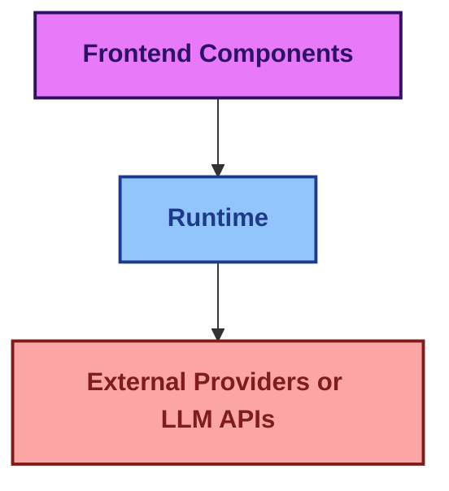
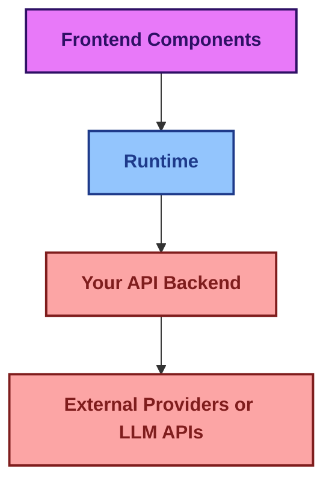
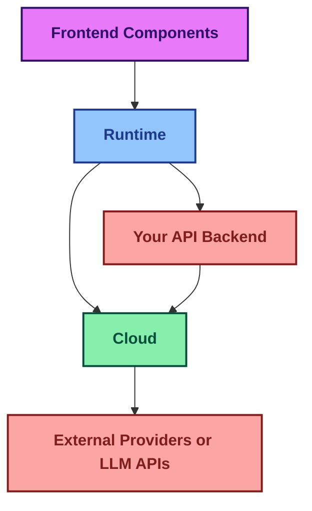

import { Sparkles, PanelsTopLeft, Database, Terminal } from "lucide-react";

## assistant-ui is built on these main pillars:

<div className="grid grid-cols-1 md:grid-cols-3 gap-4">
    <Card title='1. Frontend components'>
        Shadcn UI chat components with built-in state management
    </Card>

    <Card title='2. Runtime'>
        State management layer connecting UI to LLMs and backend services
    </Card>

    <Card title='3. Assistant Cloud'>
        Hosted service for thread persistence, history, and user management
    </Card>
</div>


### 1. Frontend components
Stylized and functional chat components built on top of Shadcn components that have context state management provided by the assistantUI runtime provider. These pre-built React components come with intelligent state management. [View our components](/docs/ui/thread)

### 2. Runtime
A React state management context for assistant chat. The runtime handles data conversions between the local state and calls to backends and LLMs. We offer different runtime solutions that work with various frameworks like Vercel AI SDK, LangGraph, LangChain, Helicone, local runtime, and an ExternalStore when you need full control of the frontend message state. [You can view the runtimes we support](/docs/runtimes/pick-a-runtime)

### 3. Assistant Cloud
A hosted service that enhances your assistant experience with comprehensive thread management and message history. Assistant Cloud stores complete message history, automatically persists threads, supports human-in-the-loop workflows, and integrates with common auth providers to seamlessly allow users to resume conversations at any point. [Cloud Docs](/docs/cloud)


### There are three common ways to architect your assistant-ui application:

#### **1. Direct Integration with External Providers**



#### **2. Using your own API endpoint**



#### **3. With Assistant Cloud**



## Design System Integration

assistant-ui primitives are **headless** — they provide behavior and state but no visual styling. The pre-built Thread component uses Tailwind + shadcn/ui, but you can build on top of any design system.

### With MUI, Ant Design, or Other UI Libraries

Use the `asChild` prop on any primitive to merge its behavior into your own components. This lets the primitive's click handler, ARIA attributes, and state management work through your design system's components without any wrapper divs.

```tsx
import { SuggestionPrimitive, ThreadPrimitive } from "@assistant-ui/react";
import { Chip } from "@mui/material";

// assistant-ui suggestion trigger + MUI Chip = zero wrapper overhead
const MuiSuggestionItem = () => (
  <SuggestionPrimitive.Trigger send asChild>
    <Chip
      label={<SuggestionPrimitive.Title />}
      variant="outlined"
      clickable
    />
  </SuggestionPrimitive.Trigger>
);

// Context-aware suggestions per page
const SUGGESTIONS_BY_ROUTE: Record<string, string[]> = {
  "/compliance":  ["Check EU AI Act compliance", "Review NIST controls"],
  "/dashboard":   ["Summarize this month", "Find cost anomalies"],
};

const SuggestionList = ({ route }: { route: string }) => (
  <ThreadPrimitive.Suggestions
    components={{ Suggestion: MuiSuggestionItem }}
  />
);
```

<Callout type="tip">
  **Seen in production:** [VerifyWise](https://github.com/verifywise-ai/verifywise) (237 stars), an AI governance platform for EU AI Act compliance, builds their entire chat UI with MUI components via `asChild` — demonstrating that assistant-ui integrates cleanly into existing enterprise design systems.
</Callout>

### Primitive Layer vs. Pre-Built Components

| Layer | Package | Use when |
|-------|---------|----------|
| Pre-built Thread | `@assistant-ui/ui` shadcn registry | Starting a new project with Tailwind |
| Primitives with `asChild` | `@assistant-ui/react` | You already have a design system |
| Context API (`useAui`) | `@assistant-ui/react` | Custom components needing full state access |

All three layers use the same runtime and work together — you can mix pre-built and custom components in the same app.