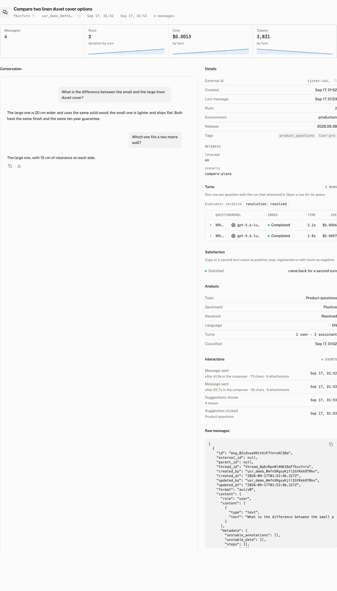

Threads is the conversation list. It starts with the active threads in the selected range, then lets you narrow the list by what people discussed, how they reacted, how they were reviewed and what the project's analysis found.


## Search the conversation list

Archived threads are hidden. The activity strip, facet counts and rows all request `archived: false`, so an archived conversation cannot add to a count while being absent from the table. The volume strip shows threads in each time bucket. Select a bar to narrow the list to that bucket.

Search matches a thread title or a full text match over stored message content.

The table has **Title**, **Topic**, **User**, **Tokens**, **Cost** and **Updated** columns. **Topic** appears once conversations are classified. A thread's thumbs up and thumbs down counts and its latest review verdict appear as marks beside the title, only on the threads that have them. **Tokens** and **Cost** can be sorted. The table loads 50 rows at a time. [Export](/docs/cloud/dashboard/exports) appears on plans that include exports.

## Filter by conversation and behaviour

The filter bar shows a facet only when it has options in the selected range. Its values describe active, nonarchived threads.

| Facet | Values and reading |
|---|---|
| **Topic** | Analysed nonjunk topics, ordered by count. |
| **Task** | Analysed tasks. |
| **Satisfaction** | `satisfied`, `mixed`, `dissatisfied` or `none`, using the rule below. |
| **Feedback** | **Thumbs down**, **Thumbs up** or **Any rating**. |
| **Review** | **Unreviewed**, **Reviewed**, **Good**, **Needs work** or **Unclear**. |
| **Signal** | A multiselect of the 12 interaction and analysis signals below. |
| **Sentiment** | `positive`, `neutral` or `negative`. |
| **Resolved** | Resolved or unresolved analysis results. |
| **Language** | The 12 most common analysed languages. |
| **Junk** | **Hide junk** selects nonjunk threads. **Only junk** selects junk threads. |
| **Question** | Analysed questions, up to 50 options. |
| **Ended on the user's message** | Threads whose last message by creation time has the `user` role. |

| Signal value | Label | Reading |
|---|---|---|
| `stopped` | Stopped | A `run_stopped` event. |
| `regenerated` | Regenerated | A `message_regenerated` event. |
| `copied` | Copied | A `message_copied` event. |
| `edited` | Edited and resent | A `message_edited` event. |
| `attachment` | Attached a file | An `attachment_added` event. |
| `suggestion` | Clicked a suggestion | A `suggestion_clicked` event. |
| `branch` | Switched branch | A `branch_switched` event. |
| `approved` | Approved a tool | A `tool_approved` event. |
| `rejected` | Rejected a tool | A `tool_rejected` event. |
| `error` | Saw an error | An `error_shown` event. |
| `no_reply` | No reply | The analysis found no assistant messages. |
| `loop` | Repeated or rephrased | The analysis found an exact repeat or a rephrase. |

An end user's thumbs rating takes precedence over behaviour for satisfaction. Without a rating, the satisfaction rule is:

```text
positive = threads.copied OR threads.run_count >= 2
negative = threads.stopped OR threads.regenerated OR threads.edited
satisfied    = positive AND NOT negative
mixed        = positive AND negative
dissatisfied = negative AND NOT positive
none         = NOT positive AND NOT negative
```

In dashboard wording, a copy or second turn is positive when there is no thumbs rating. A stop, regeneration or edit is negative when there is no thumbs rating. A thumbs rating from an end user is never a review.

## Review threads

**Review** is a second view next to **List**. It uses the same filters as the list and reports the reviewed count out of the total threads in the current selection, counts for each verdict, agreement between the latest **Good** or **Needs work** verdict and the end user's thumbs on threads that have both, and the latest notes. These figures cover the threads selected by the filters, not the whole project.

**Start reviewing** opens the first unreviewed thread in the current filter and keeps the walk on unreviewed threads. Starting with **Feedback** set to **Thumbs down** is useful when reviewing dissatisfaction.

## Inspect one thread

Select a row to open its detail page.



The top tiles are **Messages**, **Runs**, **Cost** and **Tokens**. The rest of the page brings the stored conversation, its reports and its analysis together.

| Section | What it shows |
|---|---|
| **Conversation** | The rendered transcript. End user thumbs and their comments appear under the message they were given on. |
| **Turns** | One row per question with the run that answered it. Open a row for its spans. |
| **Satisfaction** | The same positive and negative rule used in the list. |
| **Analysis** | Topic, Task, Phrasing, Sentiment, Resolved, Language, Turns, Repeats, Unanswered question and Classified. |
| **Interactions** | The engagement events for the thread. |
| **Raw messages** | The stored messages in their raw form. |

The right rail has five tabs: **Details**, **Turns**, **Activity**, **Review** and **Raw**. It opens on **Details**; a thread opened from the **Review** view or from a list filtered by review state opens on **Review** instead. On the **Review** tab a person on the team records a verdict for the whole conversation: **Good**, **Needs work** or **Unclear**. They can add an optional note, then choose **Save** or **Save and next**. `g`, `n` and `u` choose the verdict. `Mod+Enter` saves and moves on. `j` and `k` move to the next and previous thread.

**Previous** and **Next** are in the header of every thread and follow the list the thread was opened from, including that list's filters and sort. Each reviewer has one review per thread and can change it. Other reviewers' reviews are listed below the form.

The **Details** tab has **External id**, when the thread has one and with a copy control, then **Title**, which reads how the thread got its name or why it has none, then **Created**, **Last message** and **Runs**. **Environment** and **Release** show the distinct values across the thread's runs and link to [Runs](/docs/cloud/dashboard/runs) filtered to that value. **Tags** are badges that link to [Runs](/docs/cloud/dashboard/runs) filtered to the tag. The **Metadata** ledger lists the thread metadata and reads *No metadata* when there is none.

| Title row | Meaning |
|---|---|
| *Written by gpt-5.6-luna on the first message in 1.4s* | The model, the trigger that titled the thread (*on the client's request*, *on the first message* or *by the hourly sweep*) and how long the call took. |
| *Set by the client* | The title came from a rename or a thread update. |
| *Being written* | An attempt is running. |
| *Attempt 1 failed: Invalid API key. The hourly sweep retries.* | The last attempt failed with the provider's error; the sweep retries up to three times. |
| *Gave up after 3 attempts: Invalid API key* | Every attempt failed. Rename the thread. |
| *Waiting for the hourly sweep* | No attempt yet; the sweep picks the thread up. |
| *No user text to title* | The thread has no user message with text; a message that holds only a file is not title input. |
| *Titles are off for this project*, *Paused by the plan cap* | The feature is off, or the gateway allowance is used up; see [Thread titles](/docs/cloud/thread-titles). |

**Export as Markdown** downloads the transcript as a Markdown file.

## Troubleshooting

| What you see | Why | What to do |
|---|---|---|
| A thread is missing from the list. | The list excludes archived threads, and the active range, search and selected facets also limit its rows. | Clear the list filters and choose a range that includes the conversation. Check whether the thread is archived. |
| A facet is missing from the bar. | The page renders a facet only when it has options in the selected range. | Widen the range or remove the filters that leave that facet with no options. |
| Satisfaction reads *No signal*. | The thread has neither a copy or second run nor a stop, regeneration or edit. Its stored satisfaction value is `none`. | Read the **Interactions** and **Turns** sections to see the events and runs behind the rule. |
| Analysis reads *Not analysed*. | No [Intelligence](/docs/cloud/intelligence) pass has classified the thread: analysis is off, the thread is newer than the last pass, or it was stored as junk. | Check **Settings › Intelligence** and its runs ledger, or queue **Run now**. |
