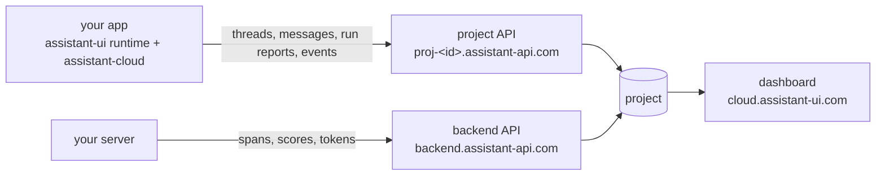

Assistant Cloud is the hosted backend for assistant-ui apps. The runtime in your app talks to it directly: threads and messages are stored as the conversation streams, every assistant response is reported with its timing, tokens, tools and outcome, and what users do around the answers is recorded as events. Your server can add the inside view by exporting its model and tool spans. The [dashboard](https://cloud.assistant-ui.com) turns all of it into pages you can read.

## What you get

- **Persistence.** Threads and messages, stored as they stream, resumed across sessions and devices, listed per user, titled by a model, archived and deleted.
- **Run reports.** Status, outcome, error, duration, time to first token, steps, tool calls, tokens, model, provider and cost for every response.
- **Traces.** An OpenTelemetry receiver that joins your server's spans to the browser's report, so one run shows the model and tool call tree under the client timing.
- **Engagement.** Sends, stops, edits, regenerations, copies and more, recorded without message text, plus thumbs and the scores your own code writes.
- **Intelligence.** Topics, tasks, unanswered questions, sentiment and resolution, judged over your conversations by a model of your choice.
- **A dashboard.** Overview, Threads, Runs, Models, Users, Engagement and Intelligence over any date range, with alerts, exports, an audit log and a read only demo.

## How it fits together

A project has two hosts. The **frontend API**, `https://proj-<id>.assistant-api.com`, answers the browser with an anonymous session or a token from your auth provider. The **backend API**, `https://backend.assistant-api.com`, answers your server with an API key: minting tokens, receiving traces, writing scores, reading the project. The `assistant-cloud` package is the client for both, and the assistant-ui runtimes drive it for you.

## Concepts

| Object | What it is |
|---|---|
| **Project** | The unit of everything: hosts, API keys, auth rules, allowed origins, retention, features and plan. |
| **Workspace and user** | Every request acts as a user inside a workspace, and a workspace owns its threads. A personal chat uses the user id as the workspace; an organization's shared threads use its id. |
| **Thread** | A conversation: a title, `last_message_at`, an archived flag, your own `external_id`, and up to 16 short metadata strings. |
| **Message** | A node in the thread's tree. `parent_id` is the message it follows, which is how edits and regenerations branch. `format` names the shape of `content`. |
| **Run** | One assistant response: status, outcome, error, model, provider, tokens, cost, timings, steps and a `trace_id`. A browser report and a server trace with the same trace id are one run. |
| **Span** | A step of a run: a model generation, a tool call, or a sampling call a tool made on its own. |
| **Event** | Something the user did: a kind, ids and a small integer, never text. |
| **Score** | A named numeric, boolean or categorical value on a run, a thread or a message. Thumbs are a boolean score named `feedback`. |

Ids are a prefix and 24 characters (`thread_0…`, `msg_0…`, `run_0…`). Timestamps are ISO 8601 in UTC; the dashboard shows them in your zone.

## Pick your integration

| You use | The cloud adds | Guide |
|---|---|---|
| The AI SDK through `useChatRuntime`, including Mastra agents | thread list, persistence, titles, run reports, engagement, feedback, attachments | [AI SDK](/docs/cloud/ai-sdk-assistant-ui) |
| Your own backend through `useLocalRuntime` or `useDataStreamRuntime` | the same, over any chat model adapter | [Local runtime](/docs/cloud/local-runtime) |
| LangGraph, LangChain or Google ADK | thread list, titles, feedback and engagement; transcripts stay with the backend and runs come from traces | [LangGraph, LangChain and ADK](/docs/cloud/langgraph) |
| AG-UI or A2A | thread list, titles, persistence, attachments, engagement and run reports, by composing the thread list yourself | [Local runtime](/docs/cloud/local-runtime#composing-the-thread-list-yourself) |
| A server without a browser: a bot, an agent, a batch job | threads, messages, titles and run reports through the client with an API key | [Servers and bots](/docs/cloud/servers) |
| A backend in another language, or a framework with OpenTelemetry | runs, steps, tool calls and models from exported spans | [Traces](/docs/cloud/traces#other-producers) |
| Vue, Svelte, or plain JavaScript | the `assistant-cloud` client alone | [Package reference](/docs/api-reference/integrations/assistant-cloud) |

The runtime guides work on React, React Native and Ink. The packages are the same; only the environment differs.

## Where to start

<Cards>
  <Card title="Quickstart" href="/docs/cloud/quickstart">
    Create a project, connect a runtime, watch the first run land in the dashboard.
  </Card>
  <Card title="Authentication" href="/docs/cloud/authorization">
    Anonymous sessions, your auth provider's tokens, API keys and allowed origins.
  </Card>
  <Card title="Run reports" href="/docs/cloud/telemetry">
    What every report carries and how to fill in model, usage and provider.
  </Card>
  <Card title="Traces" href="/docs/cloud/traces">
    Export your server's spans and see them under the browser's report.
  </Card>
  <Card title="Plans and pricing" href="/docs/cloud/pricing">
    Active users, what each plan includes, and the cap.
  </Card>
  <Card title="REST API" href="/docs/cloud/api">
    Every endpoint, for servers in other languages and evaluation jobs.
  </Card>
</Cards>

The [demo project](https://cloud.assistant-ui.com/demo) is open without an account: a retailer's synthetic support assistant that gains an hour of conversations every hour, with every page of the dashboard read only.

## Upgrading from 0.1

`@assistant-ui/core` requires `assistant-cloud@^0.2.1`, so update `assistant-cloud`, `@assistant-ui/react` and your integration package together. Then:

- Add the `messageMetadata` callback to your route; see [Run reports](/docs/cloud/telemetry#model-and-usage-from-the-route). Without it runs show as "No model reported" and cannot be priced.
- Pass `telemetry: { environment, release }` to `AssistantCloud` so runs can be filtered by deployment. Engagement events are on by default; see [Turning telemetry off](/docs/cloud/telemetry#turning-telemetry-off).
- If your server emits OpenTelemetry spans, add the span processor from [Traces](/docs/cloud/traces).
- Review **Settings › Access**: anonymous sessions and allowed origins are new settings, and both default to open.
