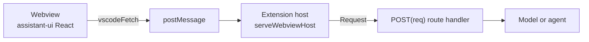

assistant-ui works in a VS Code extension through `@assistant-ui/react` and `@assistant-ui/vscode`. The webview is a React DOM environment, so the components and runtimes are the ones you use on the web. `@assistant-ui/vscode` supplies the part VS Code does not: a way for the webview to reach your backend.

<Callout type="warn">
  Never put a provider API key in webview code. Anyone can read the webview's bundle from the installed extension. Keep the key in the extension host, in `context.secrets` or the host's environment.
</Callout>

## How it works

A webview has no server behind it. Its origin is `vscode-webview://`, its Content Security Policy only allows resources from the extension, and a relative `fetch("/api/chat")` reaches nothing. `@assistant-ui/vscode` tunnels `fetch` over the webview's `postMessage` channel instead.



- In the webview, `vscodeFetch` has the signature of `fetch`. It sends the request over the channel and returns a `Response` whose body streams as the host writes it.
- In the extension host, `serveWebviewHost` rebuilds a standard `Request`, calls the route handler for its path and method, and streams the `Response` back. Stopping a run in the webview aborts `req.signal` in the handler.

The extension host runs Node.js, which has the web `Request` and `Response` classes. A route handler written for Next.js, such as `export async function POST(req: Request)`, therefore runs in the extension host without changes.

## Quick start

Scaffold the `vscode` template:

```sh
npx assistant-ui@latest create my-extension -t vscode
cd my-extension
code .
```

Press F5. The `dev` task builds the extension in watch mode, and an Extension Development Host window opens with the **Assistant** view in the secondary side bar. The first time the view opens, it prompts you to set your OpenAI API key, which it stores in VS Code's secret storage. Run **Assistant: Set OpenAI API Key** from the Command Palette to change it.

| File | Runs in | Contents |
| --- | --- | --- |
| `src/extension.ts` | Extension host | Registers the webview view, serves its routes, and writes its HTML |
| `src/api/chat/route.ts` | Extension host | The AI SDK chat route, the same handler as in the Next.js `default` template |
| `src/webview/assistant.tsx` | Webview | `useChatRuntime` over `vscodeFetch`, and the `Thread` component |
| `src/webview/app.css` | Webview | Tailwind and the VS Code theme |
| `scripts/build.mts` | Build | esbuild for the host and the webview, and Tailwind for the CSS |

`npm run package` builds a `.vsix` with `@vscode/vsce` once you set your `publisher` in `package.json`.

## Add to an existing extension

### 1. Install the packages

```sh
npm install @assistant-ui/vscode @assistant-ui/react @assistant-ui/ai-sdk ai @ai-sdk/openai zod
```

Add the assistant-ui components with the [CLI](/docs/cli) or copy them from the template.

### 2. Serve the webview from the extension host

`serveWebviewHost` answers the webview's requests with your routes, opens the links the webview forwards, and backs its storage. `renderWebviewHtml` writes the page with a Content Security Policy, a nonce on each script, and your bundle's URIs converted for the webview.

```ts title="src/extension.ts"
import { renderWebviewHtml, serveWebviewHost } from "@assistant-ui/vscode/host";
import * as vscode from "vscode";
import { POST } from "./api/chat/route";

export function activate(context: vscode.ExtensionContext) {
  const webviewDir = vscode.Uri.joinPath(context.extensionUri, "dist", "webview");

  const provider: vscode.WebviewViewProvider = {
    resolveWebviewView(view) {
      view.webview.options = {
        enableScripts: true,
        localResourceRoots: [webviewDir],
      };
      const host = serveWebviewHost(view.webview, {
        routes: { "/api/chat": { POST } },
        openExternal: (url) => vscode.env.openExternal(vscode.Uri.parse(url)),
        storage: context.globalState,
      });
      view.onDidDispose(() => host.dispose());
      view.webview.html = renderWebviewHtml(view.webview, {
        scripts: [vscode.Uri.joinPath(webviewDir, "main.js")],
        styles: [vscode.Uri.joinPath(webviewDir, "app.css")],
        title: "Assistant",
        surface: "sidebar",
        scriptType: "classic",
      });
    },
  };

  context.subscriptions.push(
    vscode.window.registerWebviewViewProvider("myExtension.chat", provider),
  );
}
```

Set `localResourceRoots` to the folder that holds the bundle, because the webview cannot load files outside it.

### 3. Mount the runtime in the webview

Pass `vscodeFetch` as the transport's `fetch`. Import `./zod-jitless` before anything else, and call `installLinkInterceptor()` so links open in the browser.

```ts title="src/webview/zod-jitless.ts"
import { config } from "zod";

// zod probes `new Function` when it builds its first object schema, which a
// strict CSP reports as a script-src violation even though zod catches it.
config({ jitless: true });
```

```tsx title="src/webview/main.tsx"
import "./zod-jitless";
import { AssistantRuntimeProvider } from "@assistant-ui/react";
import { AssistantChatTransport, useChatRuntime } from "@assistant-ui/ai-sdk";
import { installLinkInterceptor, vscodeFetch } from "@assistant-ui/vscode/webview";
import { lastAssistantMessageIsCompleteWithToolCalls } from "ai";
import { createRoot } from "react-dom/client";
import { Thread } from "@/components/assistant-ui/elements/thread.aui";

installLinkInterceptor();

const Assistant = () => {
  const runtime = useChatRuntime({
    sendAutomaticallyWhen: lastAssistantMessageIsCompleteWithToolCalls,
    transport: new AssistantChatTransport({
      api: "/api/chat",
      fetch: vscodeFetch,
    }),
  });

  return (
    <AssistantRuntimeProvider runtime={runtime}>
      <main className="h-screen">
        <Thread />
      </main>
    </AssistantRuntimeProvider>
  );
};

const root = document.getElementById("root");
if (root) createRoot(root).render(<Assistant />);
```

`sendAutomaticallyWhen` continues the run after a frontend tool, such as an approval, adds its result.

### 4. Bundle both sides

The extension host loads a CommonJS bundle that leaves `vscode` external. The webview loads one classic script: `renderWebviewHtml` puts the nonce on the script tags it writes, and a chunk loaded with `import()` carries none. React reads `process.env.NODE_ENV`, which a webview does not define, so the bundler has to replace it.

```ts title="scripts/build.mts"
import { build } from "esbuild";

await build({
  entryPoints: ["src/extension.ts"],
  outfile: "dist/extension.js",
  bundle: true,
  format: "cjs",
  platform: "node",
  target: "node22",
  external: ["vscode"],
});

await build({
  entryPoints: ["src/webview/main.tsx"],
  outfile: "dist/webview/main.js",
  bundle: true,
  format: "iife",
  platform: "browser",
  target: "chrome120",
  splitting: false,
  jsx: "automatic",
  define: { "process.env.NODE_ENV": JSON.stringify("production") },
});
```

esbuild writes the CSS that packages import, such as the Markdown styles, next to the bundle as `dist/webview/main.css`. Add it to `styles` in `renderWebviewHtml`. The template's build script also runs Tailwind and a watch mode for F5.

### 5. Follow the VS Code theme

`@assistant-ui/vscode/theme.css` maps the shadcn tokens the components use to VS Code's `--vscode-*` variables, so the view restyles itself when the user switches colour theme. Import it after Tailwind:

```css title="src/webview/app.css"
@import "tailwindcss";
@import "tw-animate-css";
@import "@assistant-ui/vscode/theme.css";
```

If you keep an existing `globals.css` from an assistant-ui template, import the theme at the end of the file instead, so its `dark` variant and fonts replace the template's. Set `surface` in `renderWebviewHtml` to `"editor"` for a webview panel in an editor tab, or to `"panel"` for a view in the bottom panel.

## Content Security Policy

`renderWebviewHtml` applies a strict policy by default: scripts and styles need the page's nonce, and `connect-src` only allows the extension's own resources. The bridge needs no `connect-src` entry, because it does not use the network.

- `csp: "relaxed"` allows inline styles, for libraries that inject `<style>` tags without a nonce.
- `connectSrc`, `frameSrc`, and `scriptSrc` append sources, and `wasmUnsafeEval: true` allows WebAssembly.
- `getCspNonce()` from `@assistant-ui/vscode/webview` returns the nonce for a library that injects tags at runtime.

The AI SDK depends on zod, and zod's first object schema probes `new Function`. The strict policy reports that as a violation even though zod recovers, which is why the webview enables zod's jitless mode before anything imports it.

## Runtimes

| Runtime | Webview | Extension host route |
| --- | --- | --- |
| [AI SDK](/docs/runtimes/ai-sdk/v7) | `useChatRuntime` with `AssistantChatTransport({ fetch: vscodeFetch })` | An AI SDK route handler that returns `toUIMessageStreamResponse()` |
| [Local](/docs/runtimes/custom/local-runtime) | `useLocalRuntime(createVSCodeModelAdapter())` | A `/api/model` handler that returns an assistant-stream or AI SDK UI message stream response |

`createVSCodeModelAdapter()` posts the thread's `messages`, `system`, and the JSON schemas of its `tools` to `/api/model`:

```ts title="src/api/model/route.ts"
import type { VSCodeModelRequest } from "@assistant-ui/vscode/host";
import { createAssistantStreamResponse } from "assistant-stream";

export async function POST(req: Request) {
  const { messages } = (await req.json()) as VSCodeModelRequest;
  return createAssistantStreamResponse(async (controller) => {
    controller.appendText(`The thread has ${messages.length} messages.`);
  });
}
```

`useDataStreamRuntime` and `useAssistantTransportRuntime` call the global `fetch` and take no `fetch` option, so they cannot reach the extension host through the bridge.

## Thread persistence

`createVSCodeStorage()` stores threads in the Memento you pass as `storage` to `serveWebviewHost`, such as `context.globalState`, so they survive reloading the window. Pair it with `useLocalRuntime`:

```tsx title="src/webview/assistant.tsx"
import { createLocalStorageAdapter } from "@assistant-ui/core/react";
import { useLocalRuntime, useRemoteThreadListRuntime } from "@assistant-ui/react";
import { createVSCodeModelAdapter, createVSCodeStorage } from "@assistant-ui/vscode/webview";

const threads = createLocalStorageAdapter({ storage: createVSCodeStorage() });
const model = createVSCodeModelAdapter();

export function useAssistantRuntime() {
  return useRemoteThreadListRuntime({
    adapter: threads,
    runtimeHook: function useThreadRuntime() {
      return useLocalRuntime(model);
    },
  });
}
```

`useChatRuntime` restores messages through a history adapter with `withFormat`, which `createLocalStorageAdapter` does not provide. With the AI SDK runtime, the thread list persists but its messages do not.

## Links, clipboard, and limitations

- **Links.** A webview cannot navigate away or open windows. `installLinkInterceptor()` sends clicks on `http:`, `https:`, and `mailto:` links, and `window.open` calls, to the host's `openExternal`, which checks the scheme again before opening the URL.
- **Clipboard.** The copy buttons write with `navigator.clipboard.writeText`, which VS Code allows in webviews.
- **Downloads.** A webview cannot save files. An action that downloads a file, such as exporting a thread as Markdown, needs a route that saves it from the extension host.
- **Speech.** The Web Speech API is not available in a webview, so `WebSpeechSynthesisAdapter` and `WebSpeechDictationAdapter` do not work. Use an adapter that calls a speech service through a route.
- **Drag and drop.** VS Code handles files dragged over its window. Hold Shift while dropping a file to drop it on the composer.
- **Hidden views.** VS Code destroys a webview's page when its view is hidden, which drops in-memory threads and interrupts a streaming reply. Pass `webviewOptions: { retainContextWhenHidden: true }` to `registerWebviewViewProvider` to keep the page alive at the cost of memory, as the template does, or persist threads with the local runtime.

## Testing

[`examples/with-vscode`](https://github.com/assistant-ui/assistant-ui/tree/main/examples/with-vscode) is the test bed for this integration. It answers with scripted fixtures, so it needs no network or API key, and its Readiness view runs probes against the live webview: the fetch bridge, aborts, frontend tools, the theme, links, thread persistence, and whether the `vscode` template still matches the test bed. From the repository root:

```sh
pnpm turbo build --filter='with-vscode^...'
pnpm --filter with-vscode test
```

The test launches VS Code through `@vscode/test-electron` and prints a table of probe results per runtime. On Linux, run it under `xvfb-run -a`.
