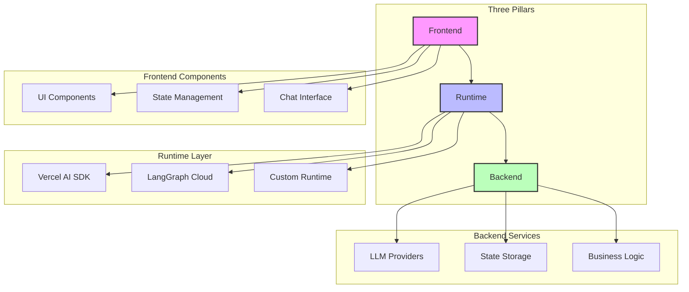
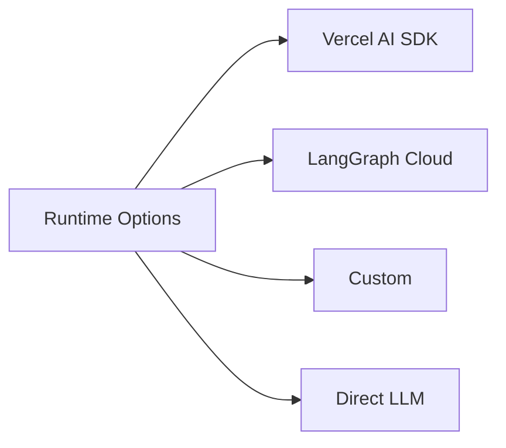
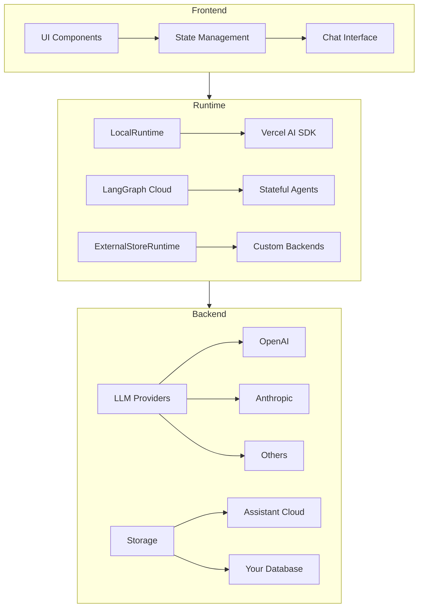

import { Sparkles, PanelsTopLeft, Database, Terminal } from "lucide-react";

Assistant-UI helps you create beautiful, enterprise-grade AI chat interfaces in minutes. Whether you're building a chatGPT clone, a customer support chatbot, an AI assistant, or a complex multi agent application, Assistant-UI provides the frontend primative components and state management layers to focus on what makes your application unique.

## Key Features

<Cards>

    <Card icon={<PanelsTopLeft className="text-purple-300" />} title='Instant Chat UI'>

    Pre-built beautiful, customizable chat interfaces out of the box. Quickly iterate on your chat idea with minimal setup. Works with any React-based framework.

    </Card>

    <Card icon={<PanelsTopLeft className="text-blue-300" />} title='Chat State Management'>

    Powerful state management for chat interactions, optimized for streaming responses and efficient rendering.

    </Card>

    <Card icon={<Database className="text-green-300" />} title='High Performance'>

    Optimized for speed and efficiency with minimal bundle size, ensuring your AI chat interfaces remain responsive.

    </Card>

    <Card icon={<Terminal className="text-orange-300" />} title='Framework Agnostic'>

    Easily integrate with any backend system, whether using Vercel AI SDK, direct LLM connections, or custom solutions.

    </Card>

</Cards>

<Callout title="Want to try it out?">
  [Get Started in 30 Seconds](/docs/getting-started).
</Callout>

  

    <h3 className="text-xl font-semibold mb-3">🚀 Instant UI</h3>
    <ul className="space-y-2">
      <li>Pre-built components</li>
      <li>Beautiful interfaces</li>
      <li>Framework agnostic</li>
      <li>High Performance</li>
      <li>Conversation thread management</li>
    </ul>
  

  

    <h3 className="text-xl font-semibold mb-3">State Management</h3>
    <ul className="space-y-2">
      <li>High Performance</li>
      <li>Optimized rendering</li>
      <li>Efficient streaming</li>
      <li>Minimal bundle size</li>
    </ul>
  

  
  

    <h3 className="text-xl font-semibold mb-3">Framework Agnostic</h3>
    <ul className="space-y-2">
      <li>Managed or Custom Backend</li>
      <li>Vercel AI SDK</li>
      <li>LangGraph support</li>
      <li>Direct LLM connections</li>
    </ul>
  

  

### 🚀 Instant UI
- Pre-built components reduce setup time from days to minutes
- Beautiful, customizable chat interfaces out of the box
- Framework agnostic - works with any React-based framework

### 🔄 Universal Integration
- Works with Vercel AI SDK
- Direct LLM connections
- LangGraph integration
- Custom backend support
- Any agent framework

### 💾 State Management
- Built-in management for chat sessions
- Tool state handling
- Conversation thread management
- Real-time updates

### ⚡ High Performance
- Optimized rendering for smooth chat experiences
- Efficient message streaming
- Minimal bundle size
- Fast response times

## Architecture

Assistant-UI is built on three main pillars:

Each pillar serves a specific purpose in the Assistant-UI ecosystem:

### 1. Frontend
Pre-built React components with intelligent state management:
- Chat interface
- Tool visualization
- Thread management
- Message editing
- History management

### 2. Runtime
Processing layer that connects UI to AI services:

### 3. Backend
Flexible backend integration options:
- LLM providers (OpenAI, Anthropic, etc.)
- State storage (Cloud or self-hosted)
- Business logic integration

## System Architecture

Here's how all the components work together:

## Getting Started

Ready to build your first AI chat interface? Check out our [Getting Started Guide](/docs/getting-started) to begin your journey with Assistant-UI.

## Need Help?

- [Documentation](/docs) - Comprehensive guides and API reference
- [GitHub](https://github.com/assistant-ui/assistant-ui) - Source code and issues
- [Discord](https://discord.gg/S9dwgCNEFs) - Community support
