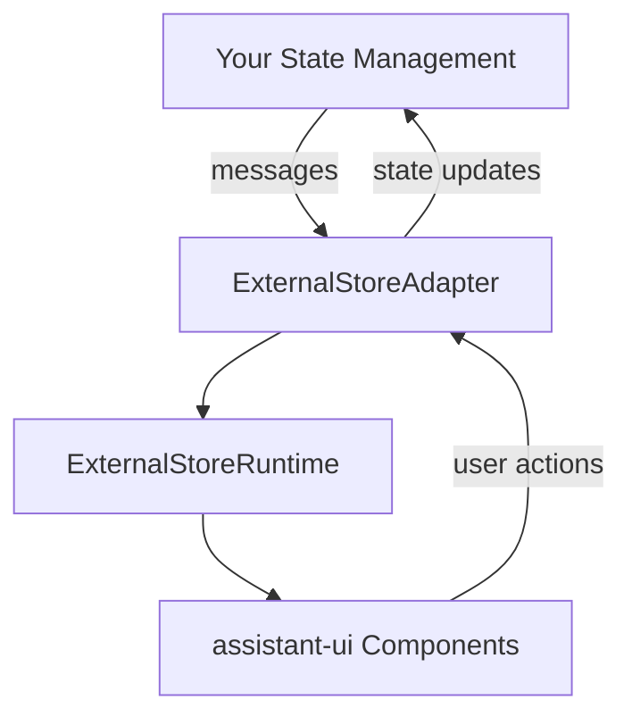

import { Callout } from "fumadocs-ui/components/callout";
import { Steps, Step } from "fumadocs-ui/components/steps";
import { Card, Cards } from "fumadocs-ui/components/card";
import { ParametersTable } from "@/components/docs";

## Overview

<Callout>
ExternalStoreRuntime gives you complete control over message state management. Choose this if you're using Redux, Zustand, or another state management library.

If you don't need this level of control, consider using [LocalRuntime](/docs/runtimes/custom/local) instead - it handles all the state management for you with built-in support for editing, branching, and persistence.
</Callout>

Use the `ExternalStoreRuntime` if you want to manage the message state yourself via any React state management library.

This runtime requires an `ExternalStoreAdapter<TMessage>` that handles communication between `assistant-ui` and your state.
Unless you are storing messages as `ThreadMessage`, you need to define a `convertMessage` function to convert your messages to `ThreadMessage`.

```tsx twoslash title="app/MyRuntimeProvider.tsx"
type MyMessage = {
  role: "user" | "assistant";
  content: string;
};
const backendApi = async (input: string): Promise<MyMessage> => {
  return { role: "assistant", content: "Hello, world!" };
};

// ---cut---
import { useState, ReactNode } from "react";
import {
  useExternalStoreRuntime,
  ThreadMessageLike,
  AppendMessage,
  AssistantRuntimeProvider,
} from "@assistant-ui/react";

const convertMessage = (message: MyMessage): ThreadMessageLike => {
  return {
    role: message.role,
    content: [{ type: "text", text: message.content }],
  };
};

export function MyRuntimeProvider({
  children,
}: Readonly<{
  children: ReactNode;
}>) {
  const [isRunning, setIsRunning] = useState(false);
  const [messages, setMessages] = useState<MyMessage[]>([]);

  const onNew = async (message: AppendMessage) => {
    if (message.content[0]?.type !== "text")
      throw new Error("Only text messages are supported");

    const input = message.content[0].text;
    setMessages((currentConversation) => [
      ...currentConversation,
      { role: "user", content: input },
    ]);

    setIsRunning(true);
    const assistantMessage = await backendApi(input);
    setMessages((currentConversation) => [
      ...currentConversation,
      assistantMessage,
    ]);
    setIsRunning(false);
  };

  const runtime = useExternalStoreRuntime({
    isRunning,
    messages,
    convertMessage,
    onNew,
  });

  return (
    <AssistantRuntimeProvider runtime={runtime}>
      {children}
    </AssistantRuntimeProvider>
  );
}
```

## When to Use

Use ExternalStoreRuntime if you need:

- **Full control over message state** - When you want to manage messages with Redux, Zustand, TanStack Query, or any React state management library
- **Custom message persistence** - When you need to implement your own storage logic, sync with databases, or maintain message history across sessions
- **Integration with existing state management** - When your application already uses a state management solution and you want to keep chat state there
- **Custom message formats** - When your backend uses a different message structure and you need to convert between formats
- **External data synchronization** - When messages need to stay synchronized with external data sources or multiple clients

## Key Features

<Cards>
  <Card
    title="State Management Integration"
    description="Works seamlessly with Redux, Zustand, TanStack Query, and more"
  />
  <Card
    title="Message Conversion"
    description="Automatic conversion between your message format and assistant-ui's format"
  />
  <Card
    title="Real-time Streaming"
    description="Built-in support for streaming responses and progressive updates"
  />
  <Card
    title="Thread Management"
    description="Multi-conversation support with archiving and thread switching"
  />
</Cards>

## Architecture

### Core Concept

The ExternalStoreRuntime enables connecting assistant-ui components with external state management systems by providing a bridge between your application's state and assistant-ui's internal runtime system.

**Key Benefits:**

- **State Control** - Maintain complete control over message state
- **Integration** - Seamlessly integrate with Redux, Zustand, TanStack Query, or any state management library
- **Flexibility** - Use your own message format with automatic conversion
- **Performance** - Built-in optimizations like message caching and intelligent chunking

### Core Components

The ExternalStoreRuntime consists of several key components:

1. **ExternalStoreAdapter** - Bridge between your state and assistant-ui
2. **ExternalStoreRuntimeCore** - Main runtime class managing threads and adapters
3. **ExternalStoreThreadRuntimeCore** - Thread-level operations and message management
4. **ExternalStoreThreadListRuntimeCore** - Multi-thread management and operations
5. **useExternalStoreRuntime** - React hook for runtime creation and management

### How It Works



### Message Conversion Process

The runtime provides intelligent message conversion and chunking:

1. **useExternalMessageConverter** - Transforms external messages to assistant-ui's internal format
2. **Message Chunking** - Groups related messages based on role and continuity
3. **Join Strategies** - Controls how related messages are combined:
   - `concat-content` (default): Concatenates content from related assistant messages
   - `none`: Keeps all messages separate

## Getting Started

<Steps>
  <Step>
    ### Install Dependencies

    ```sh npm2yarn
    npm install @assistant-ui/react
    ```

  </Step>
  
  <Step>
    ### Create Runtime Provider

    ```tsx title="app/MyRuntimeProvider.tsx"
    "use client";

    import { useState } from "react";
    import {
      useExternalStoreRuntime,
      ThreadMessageLike,
      AppendMessage,
      AssistantRuntimeProvider,
    } from "@assistant-ui/react";

    export function MyRuntimeProvider({ children }) {
      const [messages, setMessages] = useState<ThreadMessageLike[]>([]);
      const [isRunning, setIsRunning] = useState(false);

      const onNew = async (message: AppendMessage) => {
        // Add user message
        const userMessage: ThreadMessageLike = {
          role: "user",
          content: message.content,
        };
        setMessages(prev => [...prev, userMessage]);

        // Generate response
        setIsRunning(true);
        const response = await callYourAPI(message);

        const assistantMessage: ThreadMessageLike = {
          role: "assistant",
          content: response.content,
        };
        setMessages(prev => [...prev, assistantMessage]);
        setIsRunning(false);
      };

      const runtime = useExternalStoreRuntime({
        messages,
        setMessages,
        isRunning,
        onNew,
      });

      return (
        <AssistantRuntimeProvider runtime={runtime}>
          {children}
        </AssistantRuntimeProvider>
      );
    }
    ```

  </Step>

  <Step>
    ### Use in Your App

    ```tsx title="app/page.tsx"
    import { Thread } from "@assistant-ui/react";
    import { MyRuntimeProvider } from "./MyRuntimeProvider";

    export default function Page() {
      return (
        <MyRuntimeProvider>
          <Thread />
        </MyRuntimeProvider>
      );
    }
    ```

  </Step>
</Steps>

## Type Reference

### ExternalStoreAdapter

The main interface for connecting your state to assistant-ui.

<ParametersTable
  type="ExternalStoreAdapter<T>"
  parameters={[
    {
      name: "messages",
      type: "readonly T[]",
      description: "Array of messages to display",
      required: true,
    },
    {
      name: "isRunning",
      type: "boolean",
      description: "Whether the assistant is currently generating a response",
      default: "false",
    },
    {
      name: "isDisabled",
      type: "boolean",
      description: "Whether the chat input should be disabled",
      default: "false",
    },
    {
      name: "suggestions",
      type: "readonly ThreadSuggestion[]",
      description: "Suggested prompts to display to the user",
    },
    {
      name: "extras",
      type: "unknown",
      description: "Additional data accessible via runtime.extras",
    },
    {
      name: "setMessages",
      type: "(messages: T[]) => void",
      description: "Function to update messages (enables branch switching)",
    },
    {
      name: "onNew",
      type: "(message: AppendMessage) => Promise<void>",
      description: "Handler for new messages from the user",
      required: true,
    },
    {
      name: "onEdit",
      type: "(message: AppendMessage) => Promise<void>",
      description: "Handler for message edits (enables edit capability)",
    },
    {
      name: "onReload",
      type: "(parentId: string | null, config: StartRunConfig) => Promise<void>",
      description:
        "Handler for regenerating messages (enables reload capability)",
    },
    {
      name: "onCancel",
      type: "() => Promise<void>",
      description: "Handler for cancelling the current generation",
    },
    {
      name: "onAddToolResult",
      type: "(options: AddToolResultOptions) => Promise<void> | void",
      description: "Handler for adding tool call results",
    },
    {
      name: "convertMessage",
      type: "ExternalStoreMessageConverter<T>",
      description:
        "Function to convert custom message format to ThreadMessageLike",
    },
    {
      name: "joinStrategy",
      type: '"concat-content" | "none"',
      description: "Strategy for joining related assistant messages",
      default: '"concat-content"',
    },
    {
      name: "adapters",
      type: "object",
      description: "Feature adapters for additional capabilities",
      children: [
        {
          type: "adapters",
          parameters: [
            {
              name: "attachments",
              type: "AttachmentAdapter",
              description: "Enable file attachments",
            },
            {
              name: "speech",
              type: "SpeechSynthesisAdapter",
              description: "Enable text-to-speech",
            },
            {
              name: "feedback",
              type: "FeedbackAdapter",
              description: "Enable message feedback",
            },
            {
              name: "threadList",
              type: "ExternalStoreThreadListAdapter",
              description: "Enable thread management",
            },
          ],
        },
      ],
    },
    {
      name: "unstable_capabilities",
      type: "object",
      description: "Configure runtime capabilities",
      children: [
        {
          type: "unstable_capabilities",
          parameters: [
            {
              name: "copy",
              type: "boolean",
              description: "Enable message copy functionality",
              default: "true",
            },
          ],
        },
      ],
    },
  ]}
/>

### ThreadMessageLike

A flexible message format that can be converted to assistant-ui's internal format.

<ParametersTable
  type="ThreadMessageLike"
  parameters={[
    {
      name: "role",
      type: '"assistant" | "user" | "system"',
      description: "The role of the message sender",
      required: true,
    },
    {
      name: "content",
      type: "string | readonly ContentPart[]",
      description: "Message content as string or structured content parts",
      required: true,
    },
    {
      name: "id",
      type: "string",
      description: "Unique identifier for the message",
    },
    {
      name: "createdAt",
      type: "Date",
      description: "Timestamp when the message was created",
    },
    {
      name: "status",
      type: "MessageStatus",
      description:
        "Status of assistant messages (in_progress, complete, cancelled)",
    },
    {
      name: "attachments",
      type: "readonly CompleteAttachment[]",
      description: "File attachments (user messages only)",
    },
    {
      name: "metadata",
      type: "object",
      description: "Additional message metadata",
      children: [
        {
          type: "metadata",
          parameters: [
            {
              name: "steps",
              type: "readonly ThreadStep[]",
              description: "Tool call steps for assistant messages",
            },
            {
              name: "custom",
              type: "Record<string, unknown>",
              description: "Custom metadata for your application",
            },
          ],
        },
      ],
    },
  ]}
/>

### ExternalStoreThreadListAdapter

For managing multiple conversation threads.

<ParametersTable
  type="ExternalStoreThreadListAdapter"
  parameters={[
    {
      name: "threadId",
      type: "string",
      description: "ID of the current active thread",
    },
    {
      name: "threads",
      type: "readonly ExternalStoreThreadData[]",
      description: "Array of regular (non-archived) threads",
    },
    {
      name: "archivedThreads",
      type: "readonly ExternalStoreThreadData[]",
      description: "Array of archived threads",
    },
    {
      name: "onSwitchToNewThread",
      type: "() => Promise<void> | void",
      description: "Handler for creating a new thread",
    },
    {
      name: "onSwitchToThread",
      type: "(threadId: string) => Promise<void> | void",
      description: "Handler for switching to an existing thread",
    },
    {
      name: "onRename",
      type: "(threadId: string, newTitle: string) => Promise<void> | void",
      description: "Handler for renaming a thread",
    },
    {
      name: "onArchive",
      type: "(threadId: string) => Promise<void> | void",
      description: "Handler for archiving a thread",
    },
    {
      name: "onUnarchive",
      type: "(threadId: string) => Promise<void> | void",
      description: "Handler for unarchiving a thread",
    },
    {
      name: "onDelete",
      type: "(threadId: string) => Promise<void> | void",
      description: "Handler for deleting a thread",
    },
  ]}
/>

## Implementation Patterns

### Using useExternalMessageConverter

The `useExternalMessageConverter` hook provides advanced message conversion with built-in optimizations:

```tsx
import { useExternalMessageConverter } from "@assistant-ui/react";

export function MyRuntimeProvider({ children }) {
  const [messages, setMessages] = useState<MyMessage[]>([]);

  // Convert messages with caching and join strategy
  const convertedMessages = useExternalMessageConverter({
    messages,
    convertMessage: (message: MyMessage): ThreadMessageLike => ({
      role: message.role,
      content: [{ type: "text", text: message.text }],
      id: message.id,
      createdAt: new Date(message.timestamp),
    }),
    joinStrategy: "concat-content", // or "none"
  });

  const runtime = useExternalStoreRuntime({
    messages: convertedMessages, // Use pre-converted messages
    setMessages,
    onNew,
    // No need for convertMessage here since we're using pre-converted messages
  });

  return (
    <AssistantRuntimeProvider runtime={runtime}>
      {children}
    </AssistantRuntimeProvider>
  );
}
```

#### Join Strategy Examples

**concat-content (default)**: Merges adjacent assistant messages

```tsx
// Input messages:
[
  { role: "assistant", content: "Hello" },
  { role: "assistant", content: " there!" },
  { role: "user", content: "Hi" }
]

// Output with concat-content:
[
  { role: "assistant", content: [{ type: "text", text: "Hello there!" }] },
  { role: "user", content: [{ type: "text", text: "Hi" }] }
]
```

**none**: Keeps all messages separate

```tsx
// Output with none:
[
  { role: "assistant", content: [{ type: "text", text: "Hello" }] },
  { role: "assistant", content: [{ type: "text", text: " there!" }] },
  { role: "user", content: [{ type: "text", text: "Hi" }] }
]
```

### Custom Message Format

If your backend uses a different message format, use the `convertMessage` function:

```tsx
type MyMessage = {
  role: "user" | "assistant";
  text: string;
  timestamp: number;
  metadata?: Record<string, any>;
};

const convertMessage = (message: MyMessage): ThreadMessageLike => {
  return {
    role: message.role,
    content: [{ type: "text", text: message.text }],
    createdAt: new Date(message.timestamp),
    metadata: {
      custom: message.metadata,
    },
  };
};

const runtime = useExternalStoreRuntime({
  messages: myMessages,
  convertMessage,
  onNew,
  // ... other props
});
```

### Streaming Responses

Implement real-time streaming with progressive updates:

```tsx
const onNew = async (message: AppendMessage) => {
  // Add user message
  const userMessage: ThreadMessageLike = {
    role: "user",
    content: message.content,
    id: generateId(),
  };
  setMessages((prev) => [...prev, userMessage]);

  // Create placeholder for assistant message
  setIsRunning(true);
  const assistantId = generateId();
  const assistantMessage: ThreadMessageLike = {
    role: "assistant",
    content: [{ type: "text", text: "" }],
    id: assistantId,
  };
  setMessages((prev) => [...prev, assistantMessage]);

  // Stream response
  const stream = await api.streamChat(message);
  for await (const chunk of stream) {
    setMessages((prev) =>
      prev.map((m) =>
        m.id === assistantId
          ? {
              ...m,
              content: [
                {
                  type: "text",
                  text: (m.content[0] as any).text + chunk,
                },
              ],
            }
          : m,
      ),
    );
  }
  setIsRunning(false);
};
```

### Message Editing

Enable message editing by implementing the `onEdit` handler:

```tsx
const onEdit = async (message: AppendMessage) => {
  // Find the index where to insert the edited message
  const index = messages.findIndex((m) => m.id === message.parentId) + 1;

  // Keep messages up to the parent
  const newMessages = [...messages.slice(0, index)];

  // Add the edited message
  const editedMessage: ThreadMessageLike = {
    role: "user",
    content: message.content,
    id: message.id || generateId(),
  };
  newMessages.push(editedMessage);

  setMessages(newMessages);

  // Generate new response
  setIsRunning(true);
  const response = await api.chat(message);
  newMessages.push({
    role: "assistant",
    content: response.content,
    id: generateId(),
  });
  setMessages(newMessages);
  setIsRunning(false);
};
```

### Tool Calling

Support tool calls with proper result handling:

```tsx
const onAddToolResult = (options: AddToolResultOptions) => {
  setMessages((prev) =>
    prev.map((message) => {
      if (message.id === options.messageId) {
        // Update the specific tool call with its result
        return {
          ...message,
          content: message.content.map((part) => {
            if (
              part.type === "tool-call" &&
              part.toolCallId === options.toolCallId
            ) {
              return {
                ...part,
                result: options.result,
              };
            }
            return part;
          }),
        };
      }
      return message;
    }),
  );
};

const runtime = useExternalStoreRuntime({
  messages,
  onNew,
  onAddToolResult,
  // ... other props
});
```

#### Automatic Tool Result Matching

The runtime automatically matches tool results with their corresponding tool calls. When messages are converted and joined:

1. **Tool Call Tracking** - The runtime tracks tool calls by their `toolCallId`
2. **Result Association** - Tool results are automatically associated with their corresponding calls
3. **Message Grouping** - Related tool messages are intelligently grouped together

```tsx
// Example: Tool call and result in separate messages
const messages = [
  {
    role: "assistant",
    content: [
      {
        type: "tool-call",
        toolCallId: "call_123",
        toolName: "get_weather",
        args: { location: "San Francisco" },
      },
    ],
  },
  {
    role: "tool",
    content: [
      {
        type: "tool-result",
        toolCallId: "call_123",
        result: { temperature: 72, condition: "sunny" },
      },
    ],
  },
];

// These are automatically matched and grouped by the runtime
```

### File Attachments

Enable file uploads with the attachment adapter:

```tsx
const attachmentAdapter: AttachmentAdapter = {
  accept: "image/*,application/pdf,.txt,.md",
  async add(file) {
    // Upload file to your server
    const formData = new FormData();
    formData.append("file", file);

    const response = await fetch("/api/upload", {
      method: "POST",
      body: formData,
    });

    const { id, url } = await response.json();
    return {
      id,
      type: "document",
      name: file.name,
      file,
      url,
    };
  },
  async remove(attachment) {
    // Remove file from server
    await fetch(`/api/upload/${attachment.id}`, {
      method: "DELETE",
    });
  },
};

const runtime = useExternalStoreRuntime({
  messages,
  onNew,
  adapters: {
    attachments: attachmentAdapter,
  },
});
```

### Thread Management

Implement multi-conversation support:

```tsx
const [threads, setThreads] = useState<Map<string, ThreadMessageLike[]>>(
  new Map(),
);
const [currentThreadId, setCurrentThreadId] = useState("default");
const [threadList, setThreadList] = useState<ExternalStoreThreadData[]>([
  { threadId: "default", status: "regular", title: "New Chat" },
]);

const currentMessages = threads.get(currentThreadId) || [];

const threadListAdapter: ExternalStoreThreadListAdapter = {
  threadId: currentThreadId,
  threads: threadList.filter((t) => t.status === "regular"),
  archivedThreads: threadList.filter((t) => t.status === "archived"),

  onSwitchToNewThread: () => {
    const newId = `thread-${Date.now()}`;
    setThreadList((prev) => [
      ...prev,
      {
        threadId: newId,
        status: "regular",
        title: "New Chat",
      },
    ]);
    setThreads((prev) => new Map(prev).set(newId, []));
    setCurrentThreadId(newId);
  },

  onSwitchToThread: (threadId) => {
    setCurrentThreadId(threadId);
  },

  onRename: (threadId, newTitle) => {
    setThreadList((prev) =>
      prev.map((t) =>
        t.threadId === threadId ? { ...t, title: newTitle } : t,
      ),
    );
  },

  onArchive: (threadId) => {
    setThreadList((prev) =>
      prev.map((t) =>
        t.threadId === threadId ? { ...t, status: "archived" } : t,
      ),
    );
  },

  onDelete: (threadId) => {
    setThreadList((prev) => prev.filter((t) => t.threadId !== threadId));
    setThreads((prev) => {
      const next = new Map(prev);
      next.delete(threadId);
      return next;
    });
    if (currentThreadId === threadId) {
      setCurrentThreadId("default");
    }
  },
};

const runtime = useExternalStoreRuntime({
  messages: currentMessages,
  setMessages: (messages) => {
    setThreads((prev) => new Map(prev).set(currentThreadId, messages));
  },
  onNew,
  adapters: {
    threadList: threadListAdapter,
  },
});
```

## Integration Examples

### Redux Integration

```tsx title="app/chatSlice.ts"
// Using Redux Toolkit (recommended)
import { createSlice, PayloadAction } from "@reduxjs/toolkit";
import { ThreadMessageLike } from "@assistant-ui/react";

interface ChatState {
  messages: ThreadMessageLike[];
  isRunning: boolean;
}

const chatSlice = createSlice({
  name: "chat",
  initialState: {
    messages: [] as ThreadMessageLike[],
    isRunning: false,
  },
  reducers: {
    setMessages: (state, action: PayloadAction<ThreadMessageLike[]>) => {
      state.messages = action.payload;
    },
    addMessage: (state, action: PayloadAction<ThreadMessageLike>) => {
      state.messages.push(action.payload);
    },
    setIsRunning: (state, action: PayloadAction<boolean>) => {
      state.isRunning = action.payload;
    },
  },
});

export const { setMessages, addMessage, setIsRunning } = chatSlice.actions;
export const selectMessages = (state: RootState) => state.chat.messages;
export const selectIsRunning = (state: RootState) => state.chat.isRunning;
export default chatSlice.reducer;

// ReduxRuntimeProvider.tsx
import { useSelector, useDispatch } from "react-redux";
import {
  selectMessages,
  selectIsRunning,
  addMessage,
  setMessages,
  setIsRunning,
} from "./chatSlice";

export function ReduxRuntimeProvider({ children }) {
  const messages = useSelector(selectMessages);
  const isRunning = useSelector(selectIsRunning);
  const dispatch = useDispatch();

  const runtime = useExternalStoreRuntime({
    messages,
    isRunning,
    setMessages: (messages) => dispatch(setMessages(messages)),
    onNew: async (message) => {
      // Add user message
      dispatch(
        addMessage({
          role: "user",
          content: message.content,
          id: `msg-${Date.now()}`,
          createdAt: new Date(),
        }),
      );

      // Generate response
      dispatch(setIsRunning(true));
      const response = await api.chat(message);
      dispatch(
        addMessage({
          role: "assistant",
          content: response.content,
          id: `msg-${Date.now()}`,
          createdAt: new Date(),
        }),
      );
      dispatch(setIsRunning(false));
    },
  });

  return (
    <AssistantRuntimeProvider runtime={runtime}>
      {children}
    </AssistantRuntimeProvider>
  );
}
```

### Zustand Integration (v5)

```tsx title="app/chatStore.ts"
// Using Zustand v5 with TypeScript
import { create } from "zustand";
import { immer } from "zustand/middleware/immer";
import { ThreadMessageLike } from "@assistant-ui/react";

interface ChatState {
  messages: ThreadMessageLike[];
  isRunning: boolean;
  addMessage: (message: ThreadMessageLike) => void;
  setMessages: (messages: ThreadMessageLike[]) => void;
  setIsRunning: (isRunning: boolean) => void;
  updateMessage: (id: string, updates: Partial<ThreadMessageLike>) => void;
}

// Zustand v5 requires the extra parentheses for TypeScript
const useChatStore = create<ChatState>()(
  immer((set) => ({
    messages: [],
    isRunning: false,

    addMessage: (message) =>
      set((state) => {
        state.messages.push(message);
      }),

    setMessages: (messages) =>
      set((state) => {
        state.messages = messages;
      }),

    setIsRunning: (isRunning) =>
      set((state) => {
        state.isRunning = isRunning;
      }),

    updateMessage: (id, updates) =>
      set((state) => {
        const index = state.messages.findIndex((m) => m.id === id);
        if (index !== -1) {
          Object.assign(state.messages[index], updates);
        }
      }),
  })),
);

// ZustandRuntimeProvider.tsx
import { useShallow } from "zustand/shallow";

export function ZustandRuntimeProvider({ children }) {
  // Use useShallow to prevent unnecessary re-renders
  const { messages, isRunning, addMessage, setMessages, setIsRunning } =
    useChatStore(
      useShallow((state) => ({
        messages: state.messages,
        isRunning: state.isRunning,
        addMessage: state.addMessage,
        setMessages: state.setMessages,
        setIsRunning: state.setIsRunning,
      })),
    );

  const runtime = useExternalStoreRuntime({
    messages,
    isRunning,
    setMessages,
    onNew: async (message) => {
      // Add user message
      addMessage({
        role: "user",
        content: message.content,
        id: `msg-${Date.now()}`,
        createdAt: new Date(),
      });

      // Generate response
      setIsRunning(true);
      const response = await api.chat(message);
      addMessage({
        role: "assistant",
        content: response.content,
        id: `msg-${Date.now()}-assistant`,
        createdAt: new Date(),
      });
      setIsRunning(false);
    },
  });

  return (
    <AssistantRuntimeProvider runtime={runtime}>
      {children}
    </AssistantRuntimeProvider>
  );
}
```

### TanStack Query Integration

```tsx title="app/chatQueries.ts"
// Using TanStack Query v5 with TypeScript
import { useQuery, useMutation, useQueryClient } from "@tanstack/react-query";
import { ThreadMessageLike, AppendMessage } from "@assistant-ui/react";

// Query key factory pattern
export const messageKeys = {
  all: ["messages"] as const,
  thread: (threadId: string) => [...messageKeys.all, threadId] as const,
};

// TanStackQueryRuntimeProvider.tsx
export function TanStackQueryRuntimeProvider({ children }) {
  const queryClient = useQueryClient();
  const threadId = "main"; // Or from context/props

  const { data: messages = [] } = useQuery({
    queryKey: messageKeys.thread(threadId),
    queryFn: () => fetchMessages(threadId),
    staleTime: 1000 * 60 * 5, // Consider data fresh for 5 minutes
  });

  const sendMessage = useMutation({
    mutationFn: api.chat,

    // Optimistic updates with proper TypeScript types
    onMutate: async (message: AppendMessage) => {
      // Cancel any outgoing refetches
      await queryClient.cancelQueries({
        queryKey: messageKeys.thread(threadId),
      });

      // Snapshot the previous value
      const previousMessages = queryClient.getQueryData<ThreadMessageLike[]>(
        messageKeys.thread(threadId),
      );

      // Optimistically update with typed data
      const optimisticMessage: ThreadMessageLike = {
        role: "user",
        content: message.content,
        id: `temp-${Date.now()}`,
        createdAt: new Date(),
      };

      queryClient.setQueryData<ThreadMessageLike[]>(
        messageKeys.thread(threadId),
        (old = []) => [...old, optimisticMessage],
      );

      return { previousMessages, tempId: optimisticMessage.id };
    },

    onSuccess: (response, variables, context) => {
      // Replace optimistic message with real data
      queryClient.setQueryData<ThreadMessageLike[]>(
        messageKeys.thread(threadId),
        (old = []) => {
          // Remove temp message and add real ones
          return old
            .filter((m) => m.id !== context?.tempId)
            .concat([
              {
                role: "user",
                content: variables.content,
                id: `user-${Date.now()}`,
                createdAt: new Date(),
              },
              response,
            ]);
        },
      );
    },

    onError: (error, variables, context) => {
      // Rollback to previous messages on error
      if (context?.previousMessages) {
        queryClient.setQueryData(
          messageKeys.thread(threadId),
          context.previousMessages,
        );
      }
    },

    onSettled: () => {
      // Always refetch after error or success
      queryClient.invalidateQueries({
        queryKey: messageKeys.thread(threadId),
      });
    },
  });

  const runtime = useExternalStoreRuntime({
    messages,
    isRunning: sendMessage.isPending,
    onNew: async (message) => {
      await sendMessage.mutateAsync(message);
    },
    // Enable message editing
    setMessages: (newMessages) => {
      queryClient.setQueryData(messageKeys.thread(threadId), newMessages);
    },
  });

  return (
    <AssistantRuntimeProvider runtime={runtime}>
      {children}
    </AssistantRuntimeProvider>
  );
}
```

## Advanced Features

### Optimistic Updates

The runtime automatically handles optimistic assistant messages when `isRunning` is true:

```tsx
// When isRunning becomes true and last message is from user,
// an empty assistant message is automatically shown
setIsRunning(true); // Shows typing indicator
```

### Message Status

Assistant messages automatically get status based on `isRunning`:

- `"in_progress"` - When `isRunning` is true
- `"complete"` - When `isRunning` becomes false
- `"cancelled"` - When cancelled via `onCancel`

### Content Parts

Support rich content with various content part types:

```tsx
const assistantMessage: ThreadMessageLike = {
  role: "assistant",
  content: [
    { type: "text", text: "Here's the weather:" },
    {
      type: "tool-call",
      toolName: "get_weather",
      args: { location: "San Francisco" },
      result: { temperature: 72, condition: "sunny" },
    },
  ],
};
```

### Custom Capabilities

Control which features are available:

```tsx
const runtime = useExternalStoreRuntime({
  messages,
  onNew,
  onEdit, // Enables edit capability
  onReload, // Enables reload capability
  onCancel, // Enables cancel capability
  setMessages, // Enables branch switching
  adapters: {
    attachments, // Enables file attachments
    speech, // Enables text-to-speech
    feedback, // Enables message feedback
  },
  unstable_capabilities: {
    copy: false, // Disable copy functionality
  },
});
```

## Accessing External Store Messages

You can use the `getExternalStoreMessages` utility to convert `ThreadMessage`s back to your own message type.

```tsx
const MyAssistantMessage = () => {
  const myMessages = useMessage((m) => getExternalStoreMessages(m));
  // ...
};
```

Keep in mind that `getExternalStoreMessages` may return multiple messages. This is because assistant-ui merges adjacent assistant and tool messages into a single assistant message.

You can do the same operation for individual content parts as well:

```tsx
const WeatherToolUI = makeAssistantToolUI({
  render: () => {
    const myMessages = useContentPart((p) => getExternalStoreMessages(p));
    // ...
  },
});
```

## Debugging

### Common Debugging Scenarios

```tsx
// Debug message conversion
const convertMessage = (message: MyMessage): ThreadMessageLike => {
  console.log("Converting message:", message);
  const converted = {
    role: message.role,
    content: [{ type: "text", text: message.content }],
  };
  console.log("Converted to:", converted);
  return converted;
};

// Debug adapter calls
const onNew = async (message: AppendMessage) => {
  console.log("onNew called with:", message);
  // ... implementation
};

// Enable verbose logging
const runtime = useExternalStoreRuntime({
  messages,
  onNew: (...args) => {
    console.log("Runtime onNew:", args);
    return onNew(...args);
  },
  // ... other props
});
```

## Performance Tips

<Callout>
The runtime uses several optimizations to ensure smooth performance:

1. **Message Conversion Caching** - Converted messages are cached until the converter function changes
2. **Shallow Comparison** - Adapter props are shallow compared to avoid unnecessary updates
3. **Optimistic Updates** - UI updates immediately without waiting for API responses
4. **Memoization** - Use React.memo and useMemo to prevent unnecessary re-renders
</Callout>

### Best Practices

1. **Memoize Callbacks** - Use `useCallback` for adapter functions to prevent unnecessary re-renders
2. **Stable References** - Keep message arrays immutable and create new arrays when updating
3. **Batch Updates** - Update multiple messages in a single state update when possible
4. **Lazy Loading** - For thread lists, implement pagination or virtualization for large datasets

```tsx
const onNew = useCallback(async (message: AppendMessage) => {
  // Implementation
}, []); // Empty deps array for stable reference

const runtime = useExternalStoreRuntime({
  messages,
  onNew, // Stable reference prevents re-initialization
});
```

## Migration Guide

### From LocalRuntime

<Steps>
  <Step>
    ### Extract Message State
    
    Move messages from LocalRuntime to your state management:
    
    ```tsx
    // Before: LocalRuntime
    const runtime = useLocalRuntime({ initialMessages });
    
    // After: ExternalStoreRuntime
    const [messages, setMessages] = useState(initialMessages);
    const runtime = useExternalStoreRuntime({ messages, onNew });
    ```
  </Step>
  
  <Step>
    ### Implement Handlers
    
    Replace LocalRuntime's automatic handling with explicit handlers:
    
    ```tsx
    const onNew = async (message) => {
      // Add your API call logic
    };
    
    const onEdit = async (message) => {
      // Handle message editing
    };
    
    const onReload = async (parentId) => {
      // Handle message regeneration
    };
    ```
  </Step>
  
  <Step>
    ### Add Adapters
    
    Configure additional features as needed:
    
    ```tsx
    const runtime = useExternalStoreRuntime({
      messages,
      onNew,
      adapters: {
        attachments: attachmentAdapter,
        speech: speechAdapter,
      },
    });
    ```
  </Step>
</Steps>

## Troubleshooting

### Common Issues

<Callout type="error">
**Message not updating**: Ensure you're creating new array references when updating messages:

```tsx
// ❌ Wrong - mutating existing array
messages.push(newMessage);
setMessages(messages);

// ✅ Correct - creating new array
setMessages([...messages, newMessage]);
```

</Callout>

<Callout type="warning">
**Capabilities not working**: Check that you've provided the required handlers:

- Edit requires `onEdit`
- Reload requires `onReload`
- Branch switching requires `setMessages`
- Attachments require attachment adapter
</Callout>

### Debugging Tips

1. **Enable React DevTools** - Inspect the runtime state and props
2. **Log Adapter Calls** - Add console.log to adapter functions to trace execution
3. **Check Message Format** - Ensure your convertMessage function returns valid ThreadMessageLike objects
4. **Verify Async Handling** - Make sure promises are properly awaited in handlers

## API Reference

For detailed API documentation, see:

- [AssistantRuntime API](/docs/api-reference/runtimes/AssistantRuntime)
- [ThreadRuntime API](/docs/api-reference/runtimes/ThreadRuntime)
- [Runtime Providers](/docs/api-reference/context-providers/AssistantRuntimeProvider)

## Related Resources

- [Runtime Layer Concepts](/docs/concepts/runtime-layer)
- [Pick a Runtime Guide](/docs/runtimes/pick-a-runtime)
- [LocalRuntime Documentation](/docs/runtimes/custom/local)
- [Examples Repository](https://github.com/assistant-ui/assistant-ui/tree/main/examples/with-external-store)

